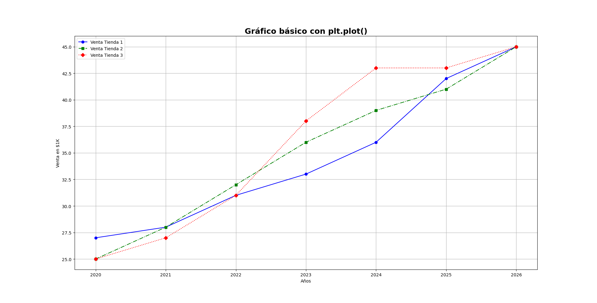
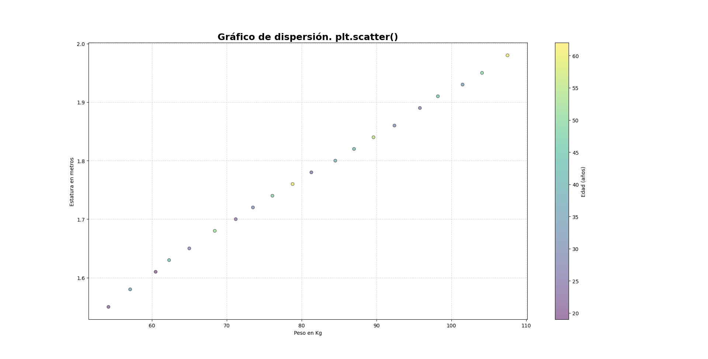
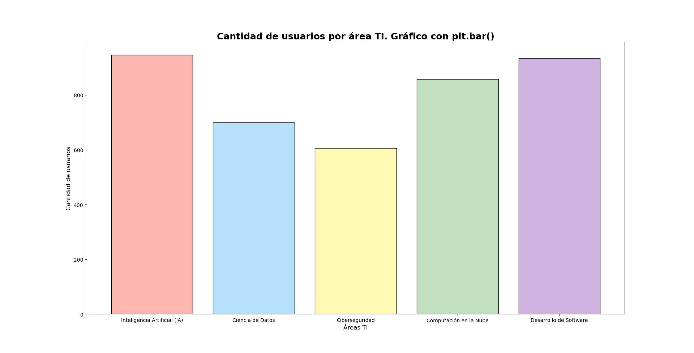
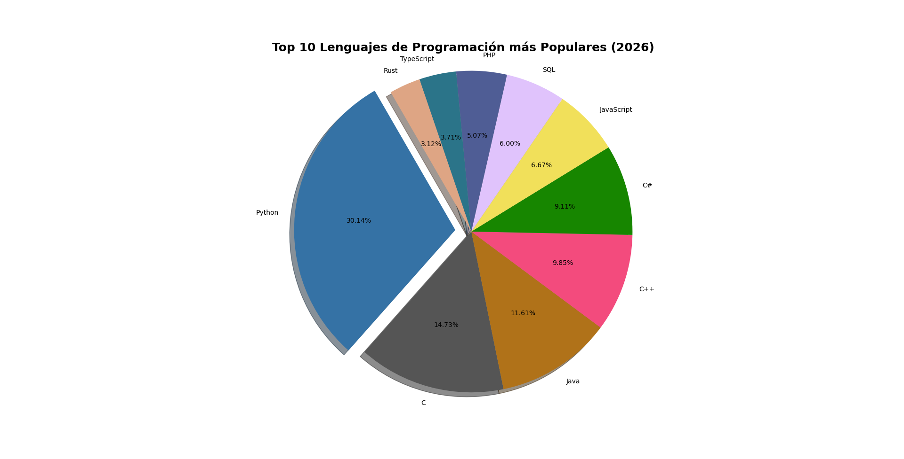
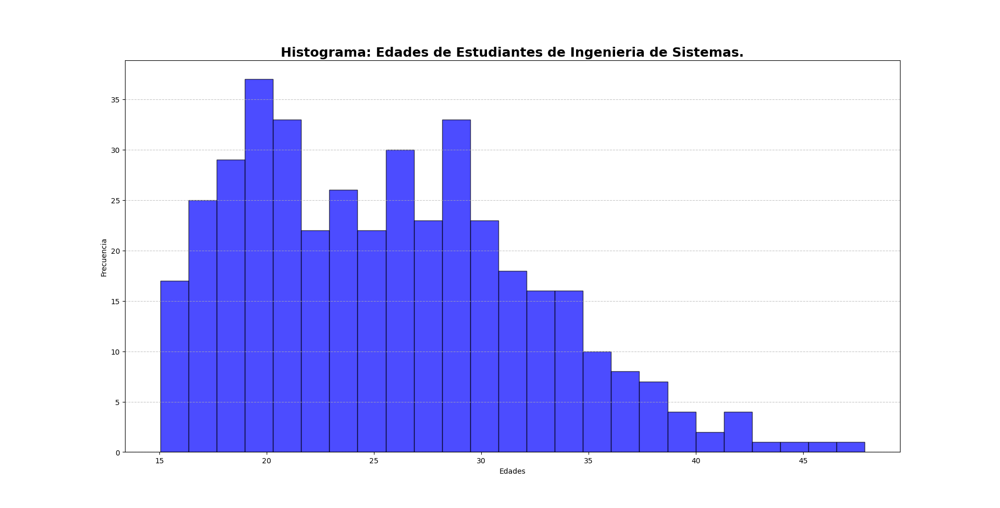
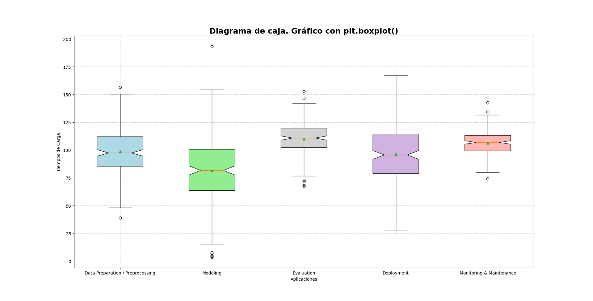
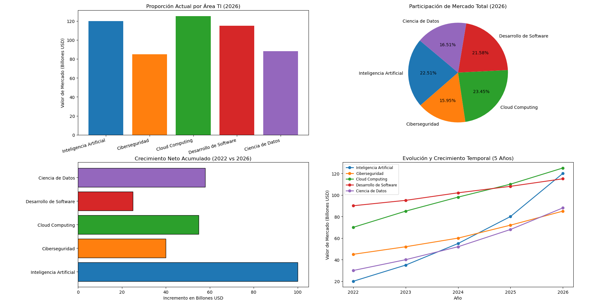

# Demostración de Matplotlib: Visualización de Datos

Este script utiliza **Matplotlib** para transformar datos duros en historias visuales, aplicando buenas prácticas de diseño y personalización de gráficos.

### Conceptos Aplicados:
*   Gráficos de líneas, dispersión, barras, pie, histograma, diagrama de caja.
*   Personalización de etiquetas, títulos, leyendas y colores.
*   Varios gráficos en una figura (subplots).

### Cómo ejecutarlo:
```bash
python3 03_matplotlib_demo/practicas_matplotlib_usos_basicos.py
```

### Output:
```text
### Gráficos de lineas plt.plot(). series temporales, datos continuos. Ej: crecimiento de ventas.
```



```text
### Diagrama de dispersión plt.scatter(). observar agrupaciones o correlación de dos variables númericas. Ej: estatura y peso.
```



```text
### Gráficos de barras plt.bar(). Comparar valores de variables discretas. Ej: Preferencia en Área TI.
```



```text
### Gráficos circular plt.pie(). Mostrar proporción de opciones seleccionadas. Ej: Lenguaje de programación más popular.
```



```text
### Histogramas plt.hist(). Distribución de frecuencias en un conjunto de datos númericos. Ej: conjunto de edades.
```



```text
### Diagrama de caja plt.boxplot(). Ideal para identificar valores atípicos, dispersión, asimetría. Ej: Detección de tiempos de carga de aplicación web.
```



```text
### Varios diagramas en un figura. Ej: Comparación de áreas TI desde varias perspectivas (linea de tiempo, proporciones, etc).
```


